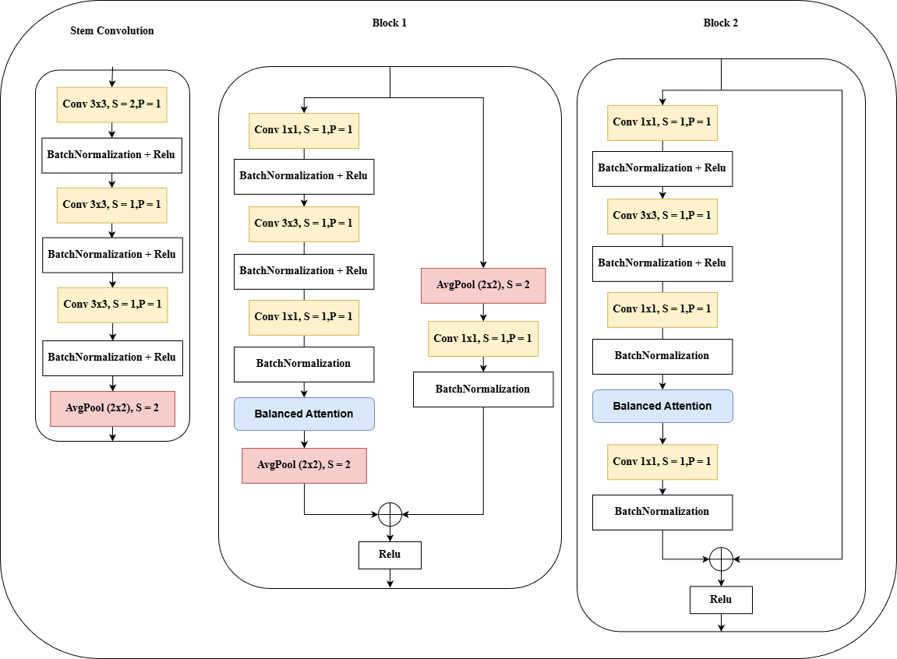
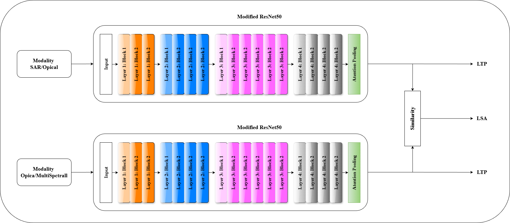
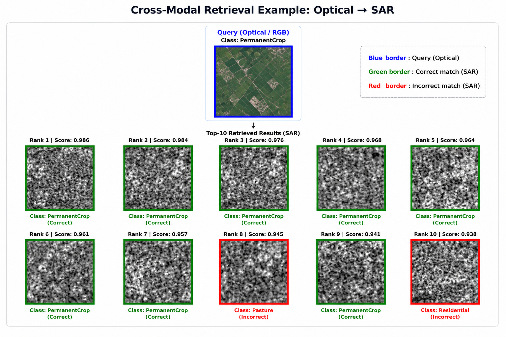
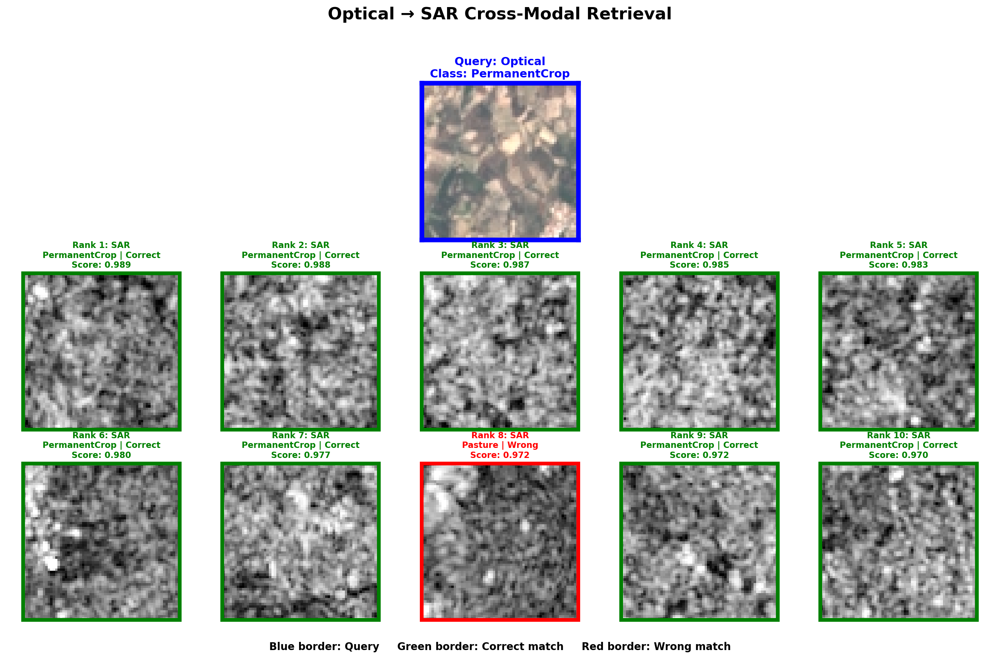
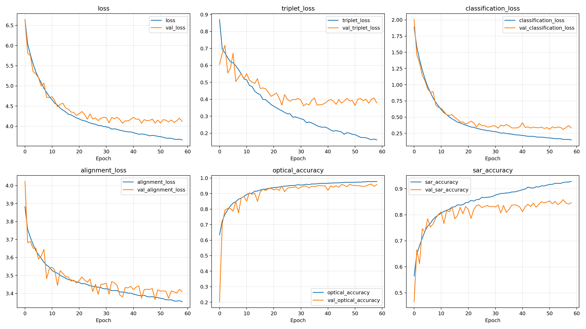
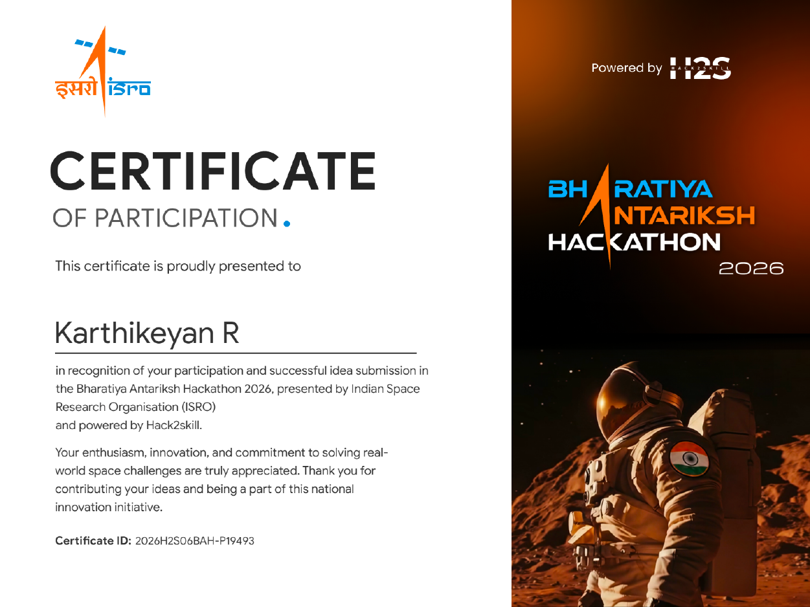

# TerraSynapse

Cross-modal satellite image retrieval for the ISRO BAH 2026 challenge.

TerraSynapse learns a shared embedding space for SAR, optical, and multispectral imagery so a query from one modality can retrieve semantically similar scenes from another.

## Architecture

- Modality-specific image encoders project satellite inputs into a common representation space.
- Attention and pooling blocks refine cross-modal features before retrieval.
- Evaluation covers same-modal and cross-modal retrieval using F1@K, Recall@K, mAP@K, and latency.

**System workflow**


**Model blocks**



**Image encoder**



## Results

**Cross-modal retrieval example**



**Optical to SAR retrieval sample**



**Training history**



Result tables:

- [Optical to SAR metrics](results/retrieval-metrics-optical-sar.csv)
- [Optical to multispectral metrics](results/retrieval-metrics-optical-multispectral.csv)

## Submission

- [Final presentation PDF](submission/final-isro-presentation.pdf)
- [Final presentation PPTX](submission/final-isro-presentation.pptx)
- [Final report PDF](submission/final-report.pdf)
- [Problem statement](submission/problem-statement-cross-modal-satellite-retrieval.pdf)
- [Dataset reference](submission/dataset-reference.pdf)

## Certificate

<!-- 
-->
<table>
  <tr>
    <td>
      <p align="center"><b>Karthikeyan</b></p>
      
    </td>
    <td>
      <p align="center"><b>Rebecca</b></p>
      
    </td>
    <td>
      <p align="center"><b>Bharath</b></p>
      
    </td>
      <td>
      <p align="center"><b>Musharraf</b></p>
      
    </td>
  </tr>
</table>

[Certificate PDF](certificates/isro-bah-2026-certificate.pdf)

## Repository Structure

```text
TerraSynapse/
|-- architecture/   # Diagrams and model workflow visuals
|-- certificates/   # Participation certificate
|-- notebooks/      # Experiment notebooks retained for reproducibility
|-- results/        # Metrics, samples, and evaluation figures
|-- submission/     # Final report, slides, and challenge references
|-- archive/        # Local drafts and source-code archive
`-- README.md
```
## Team

Built by Team EuroData for ISRO BAH 2026.

| Member | Role |
|---|---|
| [Karthikeyan Ramadoss](https://github.com/karthikeyanr103) | Model architecture, retrieval pipeline, evaluation |
| [Rebecca John](https://github.com/member-2-username) | Data preprocessing and experiments |
| [Bharath Ilayaperumal](https://github.com/member-3-username) | Training workflows and analysis |
| [Musharraf Hamdan](https://github.com/Hamdan-Musharraf) | Report, presentation, and validation |
